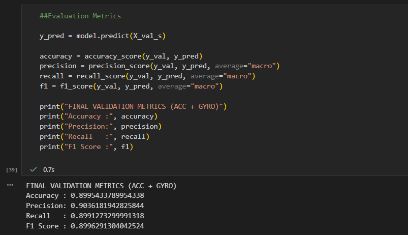
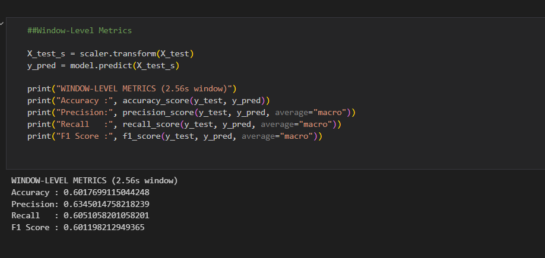
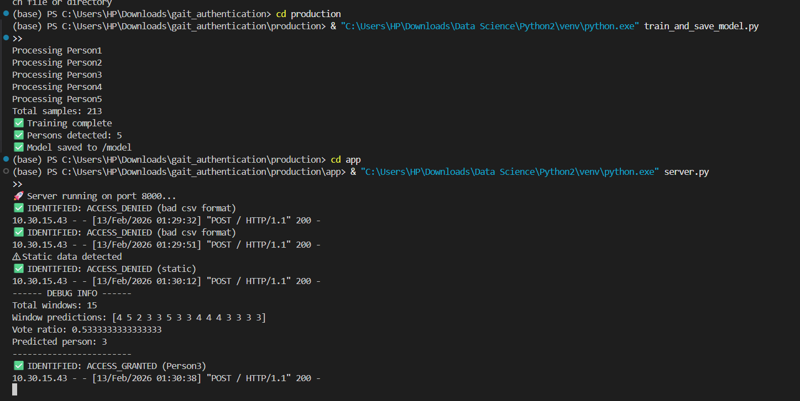
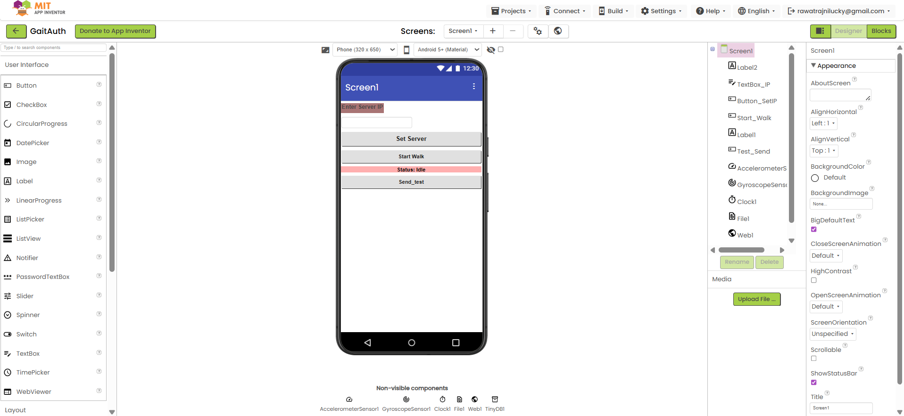
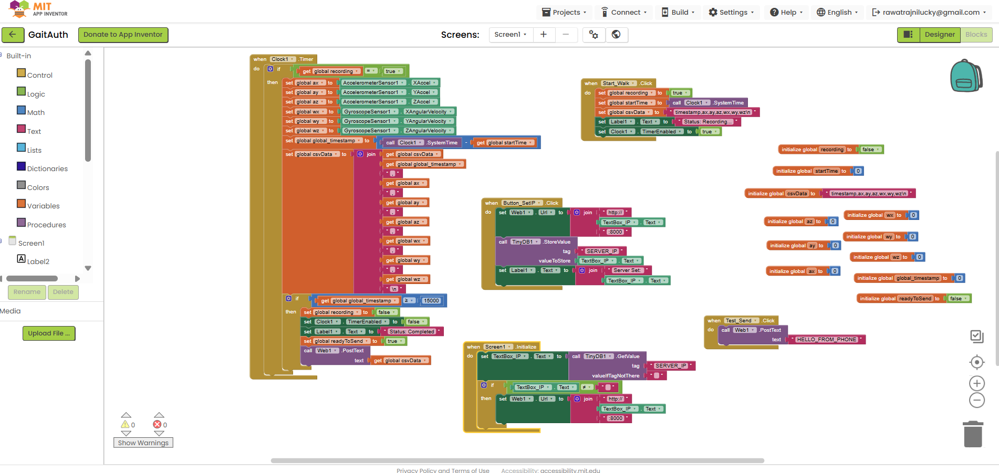
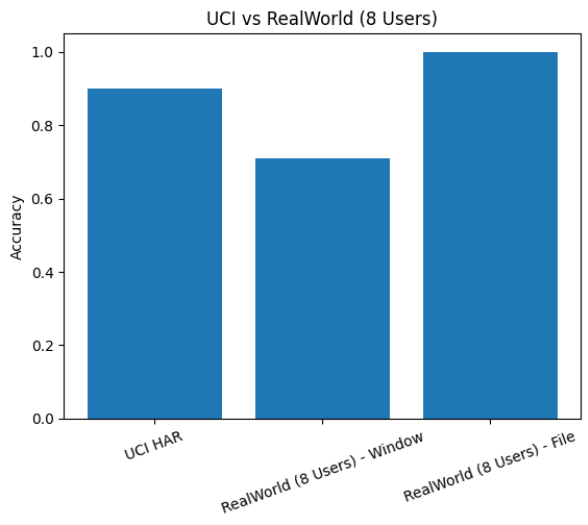

# Project Documentation  
## AI-Powered Contactless Gait Authentication System

---

# 1. Problem Overview

The objective of this project was to design a **contactless employee authentication system** using smartphone-based gait analysis.

When an employee approaches the system, their smartphone’s inertial sensor data (accelerometer + gyroscope) is analyzed to automatically grant or deny access.

The project includes:

- Research phase (model development & validation)
- Production phase (real-time authentication system)

---

# 2. Methodology Overview

## 2.1 Dataset Foundation

The project used:

- **UCI HAR Dataset (30 subjects)** as the primary benchmark dataset.

- Real-world datasets collected using:
  - Physics Toolbox Sensor Suite (Research Phase – RealWorld1)
  - Custom MIT App Inventor application (Production – RealWorldLive)

---

## 2.2 Signal Processing & Feature Engineering

Each walking session was segmented into sliding windows.

For each window:

- 3 Accelerometer axes (x, y, z)
- Accelerometer magnitude
- 3 Gyroscope axes (x, y, z)
- Gyroscope magnitude

For each signal, the following 7 features were extracted:

1. Mean  
2. Standard Deviation  
3. RMS  
4. Peak-to-Peak  
5. Dominant Frequency (FFT)  
6. Spectral Energy  
7. Frequency Spread  

Total features per window:

8 signals × 7 features = 56 features

### Why 56 Features?

The goal was to capture both:

- Time-domain characteristics (motion strength, variation)
- Frequency-domain characteristics (rhythm of walking)

FFT-based features were included because gait is inherently rhythmic and periodic.

---

## 2.3 Model Selection

Random Forest was finalized as the production model because:

- Dataset size was relatively small.
- Tree-based models handle non-linear patterns effectively.
- It provided stable accuracy without complex tuning.
- Easier to interpret and deploy compared to boosting-based models.

---

## 2.4 Windowing & Decision Logic

## 2.4 Sliding Windows & Temporal Segmentation

### Window Size

We used a fixed window size of **128 samples**.

---

### Sampling Frequency Differences

#### UCI HAR Dataset
- Sampling frequency: **50 Hz**
- 128 samples → 128 / 50 = **2.56 seconds per window**

This dataset was collected under controlled lab conditions with consistent sensor sampling.

---

#### Production System (RealWorldLive)

- Sampling frequency: **~20 Hz**
- 128 samples → 128 / 20 = **~6.4 seconds per window**

Why 20-30 Hz?

- The MIT App Inventor mobile app uses a clock timer set to 50 ms.
- 1000 ms / 50 ms ≈ 20 samples per second.
- This was a practical design decision because:
  - Lower sampling reduces mobile CPU usage.
  - Reduces battery consumption.
  - Ensures stable real-time transmission over WiFi.
  - Prevents unnecessary high-frequency noise.

Although 20-30 Hz is lower than UCI’s 50 Hz, it is sufficient to capture walking rhythm because human gait frequency typically lies below 5 Hz.

---

### Overlap Strategy

We experimented with **50% to 75% overlap**.

Overlap is calculated as:

### Majority Voting

Instead of taking a decision on a single window:

- All window predictions are aggregated.
- Final decision is based on majority class.
- Vote ratio threshold applied.

This was preferred because:

> A single window may produce incorrect classification, but majority voting increases stability and real-world reliability.

---

Initial threshold = 0.65  
Problem observed:

- Legitimate users were denied occasionally.

Final threshold = 0.45  

This improved usability while maintaining reasonable security.

Trade-off acknowledged:

- Lower threshold slightly increases risk of false acceptance.

---

# 3. Smartphone Sensors – What Is Being Measured?

## 3.1 Accelerometer

Measures **linear acceleration** along x, y, z axes.

It captures:

- Step force
- Directional movement
- Body motion intensity

## 3.2 Gyroscope

Measures **angular velocity** (rotational motion).

It captures:

- Phone orientation changes
- Subtle hand/body rotation patterns

Together, these sensors capture a unique walking signature.

---

# 4. Dataset Limitations & Scalability Strategy

The original research began with a 30-subject limitation from the UCI HAR dataset. Recognizing that a production-grade biometric system requires exposure to a much broader population to ensure high security and low False Acceptance Rates (FAR), the project shifted from a limited classification model to an expandable Metric Learning framework.

### Core System Assumptions
To maintain high precision, the current system operates under these engineering constraints:
* **Rhythmic Motion Requirement:** The user must be walking; static or irregular motion is rejected by the energy filter.
* **Sensor Consistency:** Data is captured using standard smartphone-grade inertial sensors (Accelerometer + Gyroscope).
* **Device Placement:** For optimal results, the phone should be carried in a consistent orientation (e.g., in a pocket or hand) to maintain the integrity of the learned gait signature.

---

## 4.1 Expansion Strategies Applied (Research to Production)
To bridge the gap between lab data and real-world usage, the following improvements were implemented:
1.  **Direct Data Collection:** Expanded the primary real-world test group from 5 to 10 unique users via custom collection sessions.
2.  **Multi-Session Enrollment:** Users are enrolled via three distinct 15-second walking sessions to capture natural intra-person gait variance.
3.  **High-Overlap Windowing:** Used 50% to 75% window overlap during inference to ensure no subtle biometric micro-features are lost between frames.
4.  **Session-Level Decision Making:** Replaced single-window predictions with aggregate session analysis to increase authentication stability.

---

## 4.2 Current Production Scalability Strategy (110+ Users)
The system now utilizes a sophisticated "Hybrid Scaling" approach to prepare the AI for 100+ users without requiring massive manual data collection.

* **AI-Driven Synthetic Expansion:** * **The Problem:** Deep learning models (Siamese CNNs) can overfit or "memorize" a small group of users, failing to generalize to the public.
    * **The Solution:** I developed a **Synthetic Gait Generator** that uses the 10 real users as "biological seeds" to mathematically derive 100 additional unique identities (Person 11 to 110).
* **Biological Variance Injection (Augmentation):**
    * To simulate a diverse population, the system applies **Time Warping** (changing walking pace), **Jittering** (adding sensor noise), and **Phase Shifting**.
    * This forces the Siamese network to learn the "concept" of a gait signature rather than just memorizing specific CSV files.
* **Embedding-Based Scalability:** * Because the system uses a Siamese architecture, adding a 111th or 500th user no longer requires retraining the model.
    * New employees are simply "mapped" into the existing 128-dimensional embedding space, making the system instantly scalable for large organizations.

# 5. Validation Strategy

### UCI HAR Results

- 80:20 → ~89.95%
- 70:30 → ~88.33%
- 60:40 → ~88.12%

Consistency across splits indicated:

> Model is generalizing, not memorizing.

---

### RealWorld1 (Physics Toolbox)

Window-level accuracy dropped (~70%) due to:

- Noise
- Frequency mismatch
- Device placement variation

---

### Production (RealWorldLive)

Session-level authentication achieved using:

- Majority voting
- Static filtering
- Threshold tuning

---

# 6. Why UCI ≈ 90% but Real-World ≈ 70%?

UCI HAR:

- Strict 50Hz sampling
- Controlled environment
- Fixed device placement
- Low noise

Real World:

- Inconsistent frequency
- Higher noise
- Mixed walking patterns
- Variable phone position
- Environmental disturbance

This domain shift explains performance drop.

---

# 7. 🔬 Methodology

The project's methodology evolved from a feature-engineered classification approach in the research phase to a high-performance deep metric learning pipeline for production.

---

## 7.1 Research Phase: Traditional Machine Learning
The research methodology focused on validating the feasibility of gait biometrics using established statistical techniques on the UCI HAR and RealWorld1 datasets.

* **Feature Extraction:** Sensor readings (`ax, ay, az, wx, wy, wz`) were segmented into sliding windows of 128 samples. For each window, 56 handcrafted features were extracted, including time-domain (mean, std, RMS, peak-to-peak) and frequency-domain (FFT-based dominant frequency, spectral energy, frequency spread) metrics.
* **Model Architecture:** A **Random Forest classifier** with 800 trees was utilized for its robustness on structured data and ability to handle non-linear gait patterns.
* **Decision Logic:** Majority voting was applied across overlapping windows (75% overlap) to improve session-level stability.
* **Static Filtering:** A basic energy threshold (< 0.15) was implemented to prevent false positives during periods of no movement.
* **Authentication Threshold:** Access decisions were based on a 0.45 vote ratio to balance security and usability.

---

## 7.2 Production Phase: Deep Metric Learning (Siamese CNN)
The production system was upgraded to a modern Deep Learning architecture to support infinite scalability and superior real-world noise rejection.

* **Architecture (Siamese 1D-CNN):** Replaced manual feature engineering with a **1D-Convolutional Neural Network (1D-CNN)** that automatically learns spatial-temporal gait signatures directly from raw filtered data.
* **Data Scaling & Augmentation:** * Developed a **Synthetic Gait Generator** to expand the dataset from 10 real-world users to 110 unique identities.
    * Applied biological variance injection (Warping, Jitter, and Time-shifting) during training to prevent overfitting and ensure the model generalizes to the entire population.
* **Signal Processing Pipeline:** * Implemented a **Butterworth Bandpass Filter** (0.5Hz – 3Hz) to isolate the rhythmic gait cycle while removing high-frequency jitter and low-frequency gravity bias.
* **Advanced Static Detection:** * Implemented a physics-based **3D Magnitude Walk Energy Score**.
    * A threshold of **≥ 1.0** is strictly enforced to block "lift and drop" spoofing attempts or stationary handling.
* **Embedding-Based Authentication:** * The system generates a 128-dimensional mathematical "Gait Signature" (embedding) for every walk.
    * Authentication is granted by calculating the **Cosine Similarity** between the live probe and stored user templates.
* **Production Threshold:** A stricter similarity threshold of **0.70** is used to ensure high-confidence biometric matching.

# 8. Screenshots of Working System

### UCI Validation Accuracy

### RealWorld Window-Level Accuracy

### Production Server Output

### Mobile Application Interface

### Result Comparison Graph

---

# 9. LLM Usage

LLMs were used as a technical assistant for:

- Feature engineering refinement.
- Synthetic Data generation for RealWorldLive dataset in production phase
- Data Augmentation (Generating multiple variants of specific user readings)
- Validation reasoning.
- Debugging path issues.
- Brainstorming model improvement ideas.
- MIT App Inventor logic suggestions.

All results were experimentally validated before documentation.

For detailed explanation:

See:
llm_usage.md

---

# 11. Future Work

If extended further:

- Deploy system with full frontend.
- Multi-user registration interface.
- Cloud-based inference server.
- Larger dataset collection.
- Adaptive learning system.

---

# Final Conclusion

This project demonstrates that human gait patterns captured through smartphone sensors can be transformed into a functional biometric authentication system.

The research phase validated the methodology.  
The production phase demonstrated real-time deployment feasibility.

The project highlights both the strengths and challenges of biometric gait authentication in practical environments.