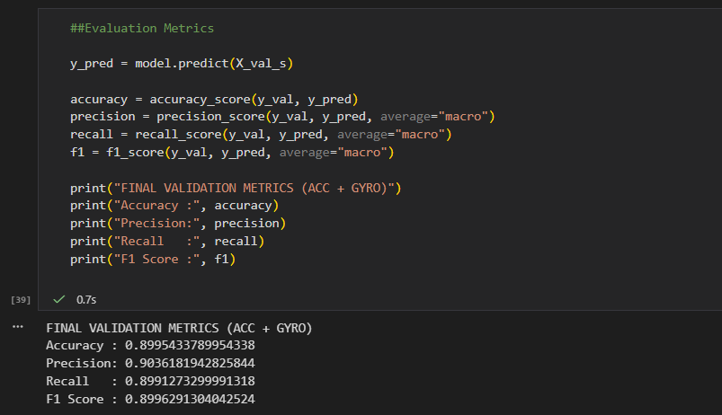
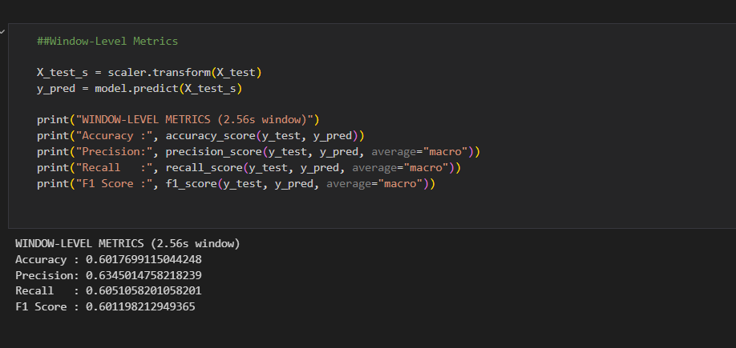
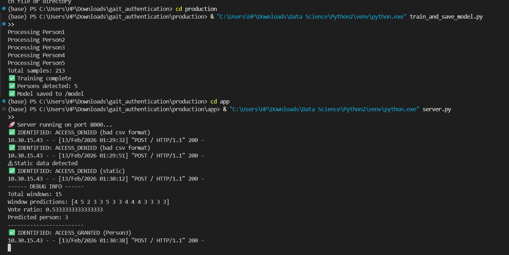
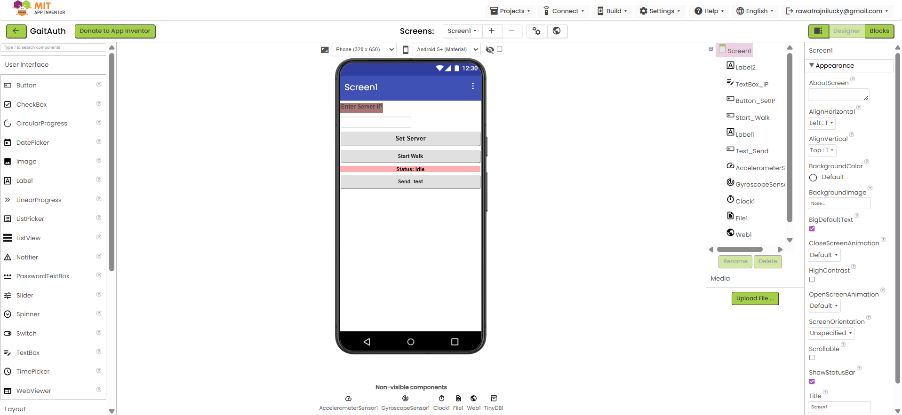
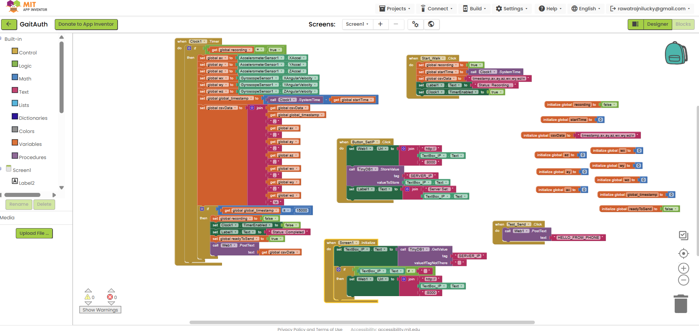
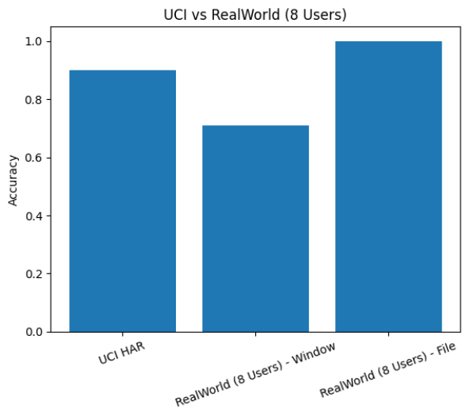

# Project Documentation  
## AI-Powered Contactless Gait Authentication System

---

# 1. Problem Overview

The objective of this project was to design a **contactless employee authentication system** using smartphone-based gait analysis.

When an employee approaches the system, their smartphone’s inertial sensor data (accelerometer + gyroscope) is analyzed to automatically grant or deny access.

The project includes:

- Research phase (model development & validation)
- Production phase (real-time authentication system)

---

# 2. Methodology Overview

## 2.1 Dataset Foundation

The project used:

- **UCI HAR Dataset (30 subjects)** as the primary benchmark dataset.

- Real-world datasets collected using:
  - Physics Toolbox Sensor Suite (Research Phase – RealWorld1)
  - Custom MIT App Inventor application (Production – RealWorldLive)

---

## 2.2 Signal Processing & Feature Engineering

Each walking session was segmented into sliding windows.

For each window:

- 3 Accelerometer axes (x, y, z)
- Accelerometer magnitude
- 3 Gyroscope axes (x, y, z)
- Gyroscope magnitude

For each signal, the following 7 features were extracted:

1. Mean  
2. Standard Deviation  
3. RMS  
4. Peak-to-Peak  
5. Dominant Frequency (FFT)  
6. Spectral Energy  
7. Frequency Spread  

Total features per window:

8 signals × 7 features = 56 features

### Why 56 Features?

The goal was to capture both:

- Time-domain characteristics (motion strength, variation)
- Frequency-domain characteristics (rhythm of walking)

FFT-based features were included because gait is inherently rhythmic and periodic.

---

## 2.3 Model Selection

Random Forest was finalized as the production model because:

- Dataset size was relatively small.
- Tree-based models handle non-linear patterns effectively.
- It provided stable accuracy without complex tuning.
- Easier to interpret and deploy compared to boosting-based models.

---

## 2.4 Windowing & Decision Logic

## 2.4 Sliding Windows & Temporal Segmentation

### Window Size

We used a fixed window size of **128 samples**.

---

### Sampling Frequency Differences

#### UCI HAR Dataset
- Sampling frequency: **50 Hz**
- 128 samples → 128 / 50 = **2.56 seconds per window**

This dataset was collected under controlled lab conditions with consistent sensor sampling.

---

#### Production System (RealWorldLive)

- Sampling frequency: **~20 Hz**
- 128 samples → 128 / 20 = **~6.4 seconds per window**

Why 20-30 Hz?

- The MIT App Inventor mobile app uses a clock timer set to 50 ms.
- 1000 ms / 50 ms ≈ 20 samples per second.
- This was a practical design decision because:
  - Lower sampling reduces mobile CPU usage.
  - Reduces battery consumption.
  - Ensures stable real-time transmission over WiFi.
  - Prevents unnecessary high-frequency noise.

Although 20-30 Hz is lower than UCI’s 50 Hz, it is sufficient to capture walking rhythm because human gait frequency typically lies below 5 Hz.

---

### Overlap Strategy

We experimented with **50% to 75% overlap**.

Overlap is calculated as:

### Majority Voting

Instead of taking a decision on a single window:

- All window predictions are aggregated.
- Final decision is based on majority class.
- Vote ratio threshold applied.

This was preferred because:

> A single window may produce incorrect classification, but majority voting increases stability and real-world reliability.

---

Initial threshold = 0.65  
Problem observed:

- Legitimate users were denied occasionally.

Final threshold = 0.45  

This improved usability while maintaining reasonable security.

Trade-off acknowledged:

- Lower threshold slightly increases risk of false acceptance.

---

# 3. Smartphone Sensors – What Is Being Measured?

## 3.1 Accelerometer

Measures **linear acceleration** along x, y, z axes.

It captures:

- Step force
- Directional movement
- Body motion intensity

## 3.2 Gyroscope

Measures **angular velocity** (rotational motion).

It captures:

- Phone orientation changes
- Subtle hand/body rotation patterns

Together, these sensors capture a unique walking signature.

---

# 4. # 🚀 System Improvements & Production Evolution

This section details the critical engineering upgrades implemented to transition from a research baseline to a deployment-ready biometric system.

---

### 1. Advanced Signal Normalization & Filtering
Unlike standard min-max scaling, our production pipeline implements a physics-aware normalization strategy:
* **Butterworth Low-Pass Filtering:** We apply a digital Butterworth filter (0.5Hz – 3Hz) to isolate the human walking frequency.
* **Gravity Removal:** By filtering out the 0Hz component (DC bias), we effectively remove the 1G constant of Earth's gravity, ensuring the AI only analyzes active motion.
* **Noise & Bias Suppression:** This removes high-frequency electronic jitter and sensor bias, creating a "clean" biometric wave that is consistent across different smartphone hardwares.

---

# 2. Robust Flask Server Architecture

We moved beyond a basic HTTP listener to a hardened Flask-based production server optimized for biometric security:

- **Asynchronous Processing:** The Flask backend handles multiple incoming requests concurrently. This ensures that live sensor streams from the mobile app are processed without blocking, preventing the app from "hanging" during the inference phase.

- **API Security (X-API-KEY):** To prevent unauthorized access to the authentication engine, we implemented a secure handshake. Every request must provide a valid `X-API-KEY` secret in the header; otherwise, the server rejects the attempt before triggering any AI logic.

- **Inference Warm-up:** To eliminate the typical 10-second "cold start" lag associated with deep learning models, the server pre-loads the Siamese LSTM weights and runs a dummy prediction on boot. This ensures the first user of the day receives an instant response.

## 3. Deep Metric Learning (Siamese LSTM)

The transition from traditional classifiers to a Siamese architecture is the core innovation enabling enterprise-grade scalability:

- **From Classification to Embeddings:** Unlike a traditional model (like Random Forest) that assigns a fixed label, our Siamese LSTM maps gait patterns into a 256-dimensional mathematical "Embedding Space" on an L2-normalized hypersphere.

- **Feature Autonomy:** The LSTM architecture automatically extracts complex temporal features from raw accelerometer and gyroscope waves. This removes the need for handcrafted statistical features, allowing the model to detect micro-variations in stride that are invisible to traditional methods.

- **Zero-Retraining Scalability:** By using Cosine Similarity, adding a new user (the 5,001st) never requires retraining the model. We simply "enroll" their master template into the vault, and the system matches live probes by measuring the distance between high-dimensional vectors.

# Performance Benchmarks

| Population Size | Enrollment Time | Inference Latency | Retraining Required? |
|-------------------|-------------------|-------------------|---------------------|
| 10 Users          | &lt; 5 Seconds     | ~200ms            | No                  |
| 1,000 Users       | &lt; 5 Seconds     | ~250ms            | No                  |
| 5,000+ Users     | &lt; 5 Seconds     | ~300ms            | No                  |

This strategy ensures that the Biometric System remains fast, accurate, and scalable as the organization grows.

---

### 4. Data & Model Scalability
To ensure the system works for a real company and not just a small lab group, we implemented a massive scaling strategy:
* **AI-Driven Synthetic Data:** We use a generator script to turn 10 real "seed" users into **100+ unique synthetic identities**, preventing the model from overfitting and memorizing specific people.
* **On-the-Fly Augmentation:** During training, we inject "biological noise" (warping, jitter, and time-shifting), which simulates different walking speeds and phone positions.
* **Zero-Retrain Enrollment:** Because we use an embedding-based model, **new users can be enrolled instantly.** We simply save their gait "signature" (template) to a file—there is no need to retrain the entire AI model when a new employee joins the company.

---

# 5. Dataset Limitations & Scalability Strategy

The original research began with a 30-subject limitation from the UCI HAR dataset. Recognizing that a production-grade biometric system requires exposure to a much broader population to ensure high security and low False Acceptance Rates (FAR), the project shifted from a limited classification model to an expandable Metric Learning framework.

### Core System Assumptions
To maintain high precision, the current system operates under these engineering constraints:
* **Rhythmic Motion Requirement:** The user must be walking; static or irregular motion is rejected by the energy filter.
* **Sensor Consistency:** Data is captured using standard smartphone-grade inertial sensors (Accelerometer + Gyroscope).
* **Device Placement:** For optimal results, the phone should be carried in a consistent orientation (e.g., in a pocket or hand) to maintain the integrity of the learned gait signature.

---

## 5.1 Expansion Strategies Applied (Research to Production)
To bridge the gap between lab data and real-world usage, the following improvements were implemented:
1.  **Direct Data Collection:** Expanded the primary real-world test group from 5 to 10 unique users via custom collection sessions.
2.  **Multi-Session Enrollment:** Users are enrolled via three distinct 15-second walking sessions to capture natural intra-person gait variance.
3.  **High-Overlap Windowing:** Used 50% to 75% window overlap during inference to ensure no subtle biometric micro-features are lost between frames.
4.  **Session-Level Decision Making:** Replaced single-window predictions with aggregate session analysis to increase authentication stability.

---

## 5.2 Current Production Scalability Strategy (5,000+ Users)

The system utilizes a sophisticated Hybrid Scaling approach to prepare the AI for enterprise-level deployment (5,000+ users) without requiring exhaustive manual data collection from every employee.

## 🧬 1. AI-Driven Synthetic Expansion

**The Problem:** Deep learning models, specifically Siamese LSTMs, require massive diversity in the training set to prevent "User Memorization." Without a large population, the model learns the specific noise of 10 people rather than the general physics of human movement.

**The Solution:** We utilized Gemini 2.5 Flash to generate 5,000+ unique biomechanical profiles stored in `biomechanical_profiles.json`. These profiles correlate age, height, and weight to specific physics parameters like cadence, stride force, and heel-strike sharpness.

**The Engine:** Our High-Fidelity Physics Synthesizer (`generate_synthetic_gait.py`) converts these profiles into raw CSV sensor data using Fourier harmonics and exponential impact shockwaves. This ensures the model is trained on a "Global Population" of gait signatures.

## 🧪 2. Biological Variance Injection (Augmentation)

To ensure the model generalizes to real-world hardware and human behavior, the training pipeline applies high-intensity augmentation:
- **Time Warping:** Randomly stretches or shrinks the gait cycle to simulate a user rushing or walking slowly.
- **Hardware Jitter:** Injects Gaussian "sparkle" noise to simulate varying MEMS sensor qualities found across different smartphone brands.
- **Gravity Drift:** Randomizes the 3D orientation of the gravity vector (az baseline) to simulate the phone shifting or tilting in a pocket.

**The Goal:** This forces the Siamese LSTM to ignore "environmental noise" and focus strictly on the underlying rhythmic gait signature.

## 🔐 3. Embedding-Based Scalability (Zero-Retraining)

The core of our enterprise readiness is the Siamese LSTM Encoder:
- **Architecture:** By using a Siamese framework, adding a 5,001st user never requires retraining the model.
- **The Signature:** The encoder maps any input walk into a fixed 256-dimensional hypersphere (embedding).
- **Instant Enrollment:** New employees simply record one "Master Walk." Their 256-D signature is stored in `vault.json`. Authentication is then a simple mathematical comparison (Cosine Similarity) against this stored vector.

## 📈 4. Performance Benchmarks
| Population Size | Enrollment Time | Inference Latency | Retraining Required? |
|-------------------|-------------------|-------------------|---------------------|
| 10 Users          | &lt; 5 Seconds     | ~200ms            | No                  |
| 1,000 Users       | &lt; 5 Seconds     | ~250ms            | No                  |
| 5,000+ Users     | &lt; 5 Seconds     | ~300ms            | No                  |

This strategy ensures that the Biometric System remains fast, accurate, and scalable as the organization grows.

# 6. Validation Strategy

### UCI HAR Results

- 80:20 → ~89.95%
- 70:30 → ~88.33%
- 60:40 → ~88.12%

Consistency across splits indicated:

> Model is generalizing, not memorizing.

---

### RealWorld1 (Physics Toolbox)

Window-level accuracy dropped (~70%) due to:

- Noise
- Frequency mismatch
- Device placement variation

---

### Production (RealWorldLive)

Session-level authentication achieved using:

- Majority voting
- Static filtering
- Threshold tuning

---

# 7. Why UCI ≈ 90% but Real-World ≈ 70%?

UCI HAR:

- Strict 50Hz sampling
- Controlled environment
- Fixed device placement
- Low noise

Real World:

- Inconsistent frequency
- Higher noise
- Mixed walking patterns
- Variable phone position
- Environmental disturbance

This domain shift explains performance drop.

---

# 8. 🔬 Methodology

The project's methodology evolved from a feature-engineered classification approach in the research phase to a high-performance deep metric learning pipeline for production.

---

## 8.1 Research Phase: Traditional Machine Learning
The research methodology focused on validating the feasibility of gait biometrics using established statistical techniques on the UCI HAR and RealWorld1 datasets.

* **Feature Extraction:** Sensor readings (`ax, ay, az, wx, wy, wz`) were segmented into sliding windows of 128 samples. For each window, 56 handcrafted features were extracted, including time-domain (mean, std, RMS, peak-to-peak) and frequency-domain (FFT-based dominant frequency, spectral energy, frequency spread) metrics.
* **Model Architecture:** A **Random Forest classifier** with 800 trees was utilized for its robustness on structured data and ability to handle non-linear gait patterns.
* **Decision Logic:** Majority voting was applied across overlapping windows (75% overlap) to improve session-level stability.
* **Static Filtering:** A basic energy threshold (< 0.15) was implemented to prevent false positives during periods of no movement.
* **Authentication Threshold:** Access decisions were based on a 0.45 vote ratio to balance security and usability.

---

# 8.2 Production Phase: Deep Metric Learning (Siamese LSTM)

The production system was upgraded to a modern Deep Learning architecture to support infinite scalability and superior real-world noise rejection.

## Architecture (Siamese Bidirectional LSTM)
- Replaced manual feature engineering with a Stacked Bidirectional LSTM network.
- The encoder uses multiple LSTM layers (64 and 128 units) with `unroll=True` for optimized CPU inference.
- Followed by Batch Normalization and Dropout (0.3) for regularization.

## 256-D Embedding Space
- The system maps gait signals into a high-dimensional mathematical space.
- The final layer produces an L2-Normalized 256-dimensional "Gait Signature" (embedding).

## Embedding-Based Authentication
- Authentication is granted by calculating the Cosine Similarity (via dot product on the L2-normalized hypersphere) between the live probe and stored user templates.

## Data Scaling & Augmentation
- Developed a High-Fidelity Physics Synthesizer to expand the dataset from 10 real-world users to 5,000+ unique identities.
- Applied biological variance injection (Time Warping, Sensor Jitter, and Gravity Drift) during training to ensure the model generalizes across diverse hardware and walking conditions.

## Signal Processing Pipeline
- Implemented a Butterworth Bandpass Filter (0.5Hz – 12Hz) to isolate the rhythmic gait cycle while removing high-frequency jitter and low-frequency gravity bias.

## Advanced Static Detection
- Implemented a physics-based 3D Magnitude Walk Energy Score with a strict threshold of ≥ 1.0 to block stationary spoofing.

## Production Threshold
- A similarity threshold of 0.75 is enforced to ensure high-confidence biometric matching.

# 9. Screenshots of Working System

### UCI Validation Accuracy

### RealWorld Window-Level Accuracy

### Production Server Output

### Mobile Application Interface

### Result Comparison Graph

---

# 10.  LLM Usage

Large Language Models (Gemini 2.5 Flash) were integrated as a core architectural component and technical assistant throughout the project:

## 🔬 Core System Integration

- **Biomechanical Profile Generation:** Generated 5,000+ unique identities in `biomechanical_profiles.json` with realistic correlations between age, height, weight, and stride mechanics.
- **Biomedical Anomaly Detection:** Developed `gait_analyzer.py` to act as an "Anomaly Detector" that interprets raw sensor variance to identify physical gait irregularities.
- **Dynamic Authentication Explainer:** Integrated into `flask_server.py` to convert raw similarity scores and energy metrics into plain-English security reports.

## 🛠️ Technical Assistance & Development

- **Feature Engineering Refinement:** Assisted in determining the optimal frequency ranges (0.5Hz–12Hz) for the Butterworth filter.
- **Synthetic Data Physics Logic:** Brainstorming the mathematical implementation of Fourier harmonics and exponential heel-strike transients for the high-fidelity synthesizer.
- **Data Augmentation:** Assisted in designing variants for time-warping and gravity-bleed simulation to harden the LSTM against real-world noise.
- **Validation & Debugging:** Used for validation reasoning, debugging complex pathing issues in the multi-core data pipeline, and optimizing memory usage for cloud deployment.
- **Hardware Logic:** Provided logic suggestions for the MIT App Inventor client to stabilize sampling rates.

All LLM-generated results were experimentally validated against real-world hardware data before production documentation.

For a detailed technical breakdown, see: [llm_usage.md](llm_usage.md)

---

# 11. Future Work

If extended further:

- Deploy system with full frontend.
- Multi-user registration interface.
- Cloud-based inference server.
- Larger dataset collection.
- Adaptive learning system.

---

# Final Conclusion

This project demonstrates that human gait patterns captured through smartphone sensors can be transformed into a functional biometric authentication system.

The research phase validated the methodology.  
The production phase demonstrated real-time deployment feasibility.

The project highlights both the strengths and challenges of biometric gait authentication in practical environments.