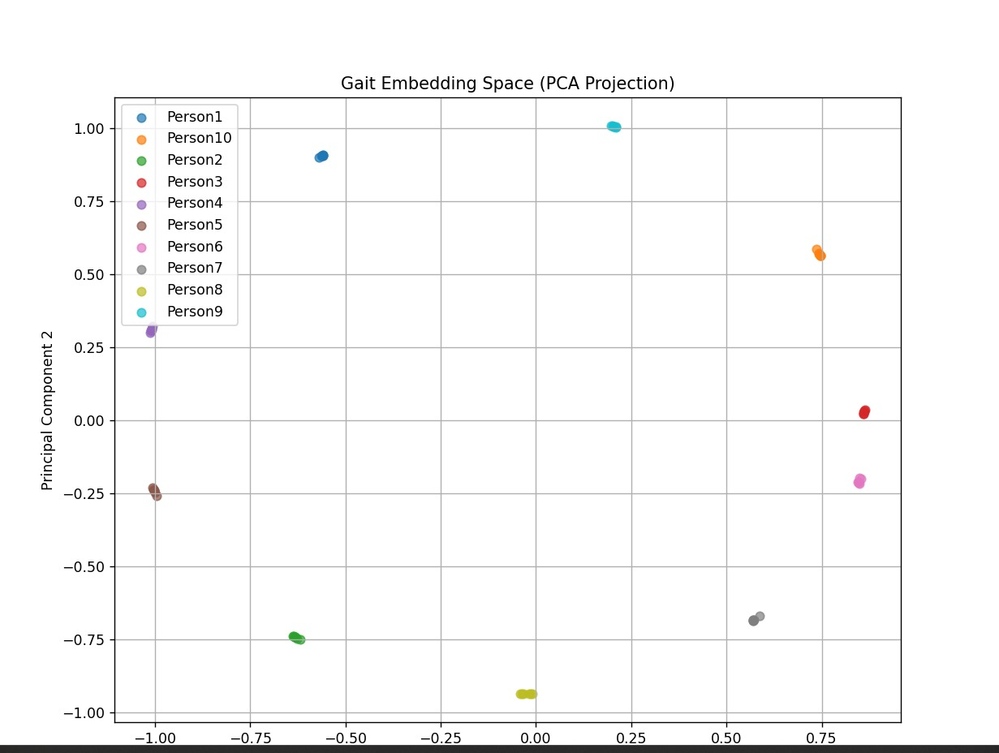

# 📦 Gait-Secure: Production-Grade Biometric Authentication

AI-Powered Contactless Employee Security System via Siamese LSTM & LLM Diagnostics

This repository contains the deployment-ready implementation of a contactless biometric security system. By analyzing smartphone-based motion signatures (Accelerometer + Gyroscope), the system identifies enrolled personnel with high precision using Deep Metric Learning and provides real-time biomechanical diagnostics via Large Language Models.

## 🏗️ 1. System Architecture & Methodology

The production system has transitioned from traditional classifiers to a modern Deep Metric Learning pipeline integrated with a Biomedical LLM Layer for real-world enterprise scalability.

### 🔬 Core Methodology

#### A. Siamese LSTM + LLM Integration

- **Siamese LSTM:** Learns to map complex temporal gait signals into a 128-dimensional embedding space. Authentication is performed via Cosine Similarity. The LSTM architecture is specifically optimized for sequential sensor data.
- **LLM Diagnostic Layer (Gemini 2.5 Flash):** Acts as the "Expert Brain." When the model processes a walk, the LLM analyzes the raw physical metrics (Energy, Variance, Score) to provide a plain-English explanation of why access was granted or denied.

#### B. Signal Processing & Preprocessing

- **Butterworth Bandpass Filter:** Processes raw data (0.5Hz – 12Hz) to isolate the rhythmic gait cycle while stripping away DC Bias (Gravity) and High-Frequency Jitter.
- **Selective Normalization:** Maintains the intensity scales that define individual biometric signatures rather than crushing them with standard scaling.

#### C. Physics-Based Security: 3D Magnitude Energy Score

To defeat "Static Spoofing" (e.g., shaking the phone manually), we implement a robust Walk Energy Score.

**Formula:**
```
Energy = std(√(a_x² + a_y² + a_z²))
```
**Threshold:** A score ≥ 1.0 is strictly required. Any signal below this is rejected as a "Static/Fake Walk."

## 📈 2. Dataset Scalability & AI Augmentation

### 🧬 AI-Driven Synthetic Scaling (5,000+ Users)
To bridge the gap between a 10-person pilot and an enterprise-scale system, we utilize an LLM-driven physics synthesizer.
- **LLM Profile Generation:** We used Gemini 2.5 Flash to generate 5,000+ unique biomechanical profiles. These profiles correlate age, height, and weight to specific cadence and impact forces.
- **High-Fidelity Physics Engine:** The `generate_synthetic_gait.py` script uses these profiles to synthesize CSV data that includes Fourier Harmonics and Exponential Heel-Strike Transients.
- **Hardware DNA:** Synthetic data matches the MIT App Inventor hardware rate (~38Hz) and timestamp sequence (starts 22–36ms, ends ~15,000ms).

# 3. Project Folder Structure

**GAIT_AUTHENTICATION/**

- **production/**
  - **app/**
    - `flask_server.py` — Biometric API + LLM Explanation Engine
    - `gait_analyzer.py` — LLM Anomaly Diagnostic Engine
  - **LSTM_engine/**
    - `build_encoder.py` — Siamese LSTM Network Architecture
    - `dataset_loader.py` — Signal Preprocessing & Augmentation
    - `train_siamese.py` — Contrastive Loss Training Pipeline
    - `enroll_templates.py` — Biometric Vault Generation
    - `siamese_lstm.weights.h5` — Trained Model Weights
    - `vault.json` — Encrypted Biometric Signatures
  - **RealWorldData/**
    - **Person1/ ... Person10/** — Ground-truth MIT App CSVs
    - `generate_synthetic_gait.py` — High-Fidelity Physics Synthesizer
    - `biomechanical_profiles.json` — LLM-Generated Identities (5k+)
  - **synthetic_data/** — AI-Generated Person11 to Person4500+
  - **mobile_app/**
    - `GaitAuth_Live.apk` — Android Client (MIT App Inventor)
  - `received_gait.csv` — Temporary live sensor buffer
  - `requirements.txt` — Production-specific dependencies

  # 🛠️ 4. Setup & Execution Guide

## 1. Prepare Environment

```bash
pip install -r requirements.txt
```

## 2. Generate Biomechanical Profiles
Get user profiles through LLM:

```bash
python production/RealWorldData/generate_llm_profiles.py
```

## 3. Scale the Dataset
Run the high-fidelity synthesizer to create the training pool from LLM-generated profiles:

```bash
python production/RealWorldData/generate_synthetic_gait.py
```

## 4. Clean the biomechanical profiles generated by LLM
Run clean_profiles.py to clean the json generated by LLM

```bash
python production/RealWorldData/clean_profiles.py
```

## 5. Train & Enroll
Train the LSTM encoder and then generate the mathematical templates for authorized personnel:
- ```bash
  python production/LSTM_engine/train_siamese.py
- ```bash
  python production/LSTM_engine/enroll_templates.py
```

## 5. Launch the Robust Server
```bash
python production/app/flask_server.py
```

# 5. Robust Flask Server & LLM Diagnostics

The backend is engineered for high-speed response and stability in enterprise environments:

- **AI Warm-up Routine:** Upon startup, the server loads the trained Siamese LSTM encoder and the global feature scaler into memory. This pre-initialization prevents TensorFlow cold-start latency and ensures instant inference when the first authentication request arrives.

- **The Physics Guard (Walk Energy Score):** Before any AI processing occurs, the server computes a 3D-Magnitude Energy Score. Any signal with energy below **1.0** is immediately rejected as a **Static/Fake Walk**, preventing spoofing attempts such as manually shaking or lifting the phone.

- **Window-Based Biometric Verification:** Incoming gait recordings are segmented into multiple time windows. Each window generates a **256-D embedding**, and a voting mechanism determines the most likely identity, improving robustness against noisy or inconsistent steps.

- **LLM Authentication Explainer:** Instead of returning only a similarity score, the server integrates **Gemini 2.5 Flash** to generate a clear, human-readable explanation of each authentication decision based on similarity score, walk energy, and gait variance.

- **Biomechanical Anomaly Detection:** The system integrates `gait_analyzer.py` to analyze gait metrics and detect anomalies such as rushing, irregular cadence, unstable stride patterns, or device misuse.

- **Memory Optimization:** Designed to process continuous sensor streams efficiently while maintaining a low memory footprint (approximately **512MB–1GB RAM**).

- **Secure API Architecture:** The Flask API implements **X-API-KEY authentication**, replay protection via timestamp validation, and strict request validation to secure all mobile-to-server communication.

## 🔑 6. Authentication Decision Logic

The system returns decisions based on both LSTM Similarity and LLM Diagnostics:

| Response | Logic | LLM Explanation Role |
| --- | --- | --- |
| **ACCESS GRANTED** | Similarity ≥ 0.75 | Confirms rhythmic match and stable energy |
| **ACCESS DENIED** | Similarity < 0.75 | Explains anomaly (e.g., Gait mismatch/Imposter) |
| **STATIC DETECTED** | Energy Score < 1.0 | Identifies stationary phone/fake movement |
| **ANOMALY DETECTED** | High Variance | Detects rushing or irregular walking patterns via `gait_analyzer.py` |

---

## ✅ 7. Deployment Readiness

- **Scalability:** Infinite enrollment via 256-D LSTM embeddings.
- **Explainability:** Transparent AI reasoning for every security decision using Gemini 2.5.
- **Security:** Multi-layer check (3D Energy + LSTM Embedding + LLM Anomaly Detection).

## 8.Training Results

## Gait Embedding Visualization

## Gait Embedding Visualization



*PCA projection of the learned gait embedding space showing clear separation between enrolled users.*

## 🚀 Live Deployment

Biometric gait authentication model is deployed on HuggingFace Spaces.

### API Endpoint
POST https://kartik33541-gait-authentication.hf.space/predict

Header:
X-API-KEY: GAIT_SECURE_2026

### Server Status
https://kartik33541-gait-authentication.hf.space

### Live Logs
https://huggingface.co/spaces/kartik33541/gait-authentication

